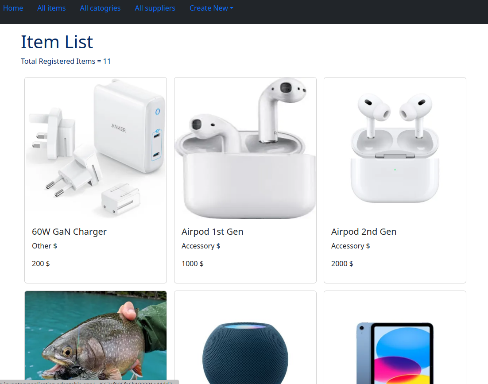

# Inventory Web Apps / Odin-InventoryApplication

A simple full-stack application to CRUD with postgreSQL, using Express + Cloudinary. This is part of projects built along The Odin Project Course.

## Live demo
- https://odin-inventoryapplication-postgresql.onrender.com/

## Tech stack 
-  Pug / Bootstrap/ Express / PostgreSQL / Cloudinary

## Source
- https://github.com/WongYC-66/odin-InventoryApplication-PostgreSQL

## Installation
1. Create account and get your API key from Cloudinary
2. Create .env file and fill in like .env-sample, place ur postgresql connection string at DB_URI
3. npm install
4. npm run serverstart

